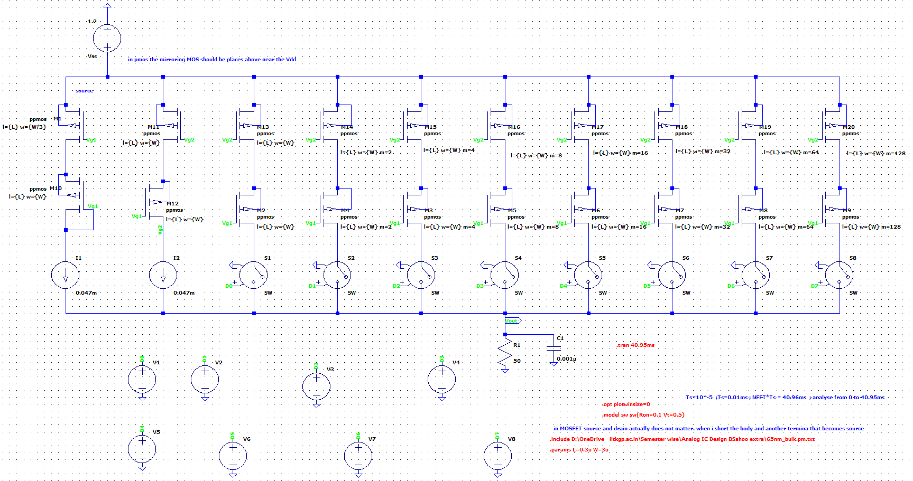
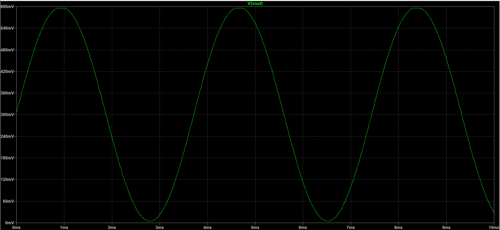

# Digital to Analog Converter (DAC)

Implemented a 8-bit Digital to Analog Converter (DAC) using Simple Current Mirror and a Low Voltage Sooch Cascode Current Mirror models on LTSpice using 65-nm technology.

**Folder structure:**

- Simple Current Mirror: Contains 'long_channel.asc' and 'short_channel.asc' which are DAC designed using simple current mirror
- Simple Current Mirror->long_channel.asc : DAC designed with Simple current Mirror using long channel MOSFET
- Simple Current Mirror->short_channel.asc : DAC designed with Simple current Mirror using short channel MOSFET
- Simple Current Mirror->SS: Contains a snapshot of the counter pulse generated
- Low Voltage Sooch: Contains DAC designed using Low Voltage Sooch Cascode Current mirror
- Low Voltage Sooch->direct_pulse->long_channel_pulse_generator.asc : DAC designed with Low Voltage Sooch Cascode Current mirror and takes input with pulse generator
- Low Voltage Sooch->sine_wave->MATLAB_sine_wave: Contains MATALB generated sine wave in Bit-wise format.
- Low Voltage Sooch->sine_wave->long_channel.asc : DAC designed with Low Voltage Sooch Cascode Current mirror and takes input from MATLAB generated bit text files
- nst_utils.py: Contains functions for use during loading dataset

**Software used in this project:** LTSpice

**Technology used in this project:** 65-nm PTM models downloaded from http://ptm.asu.edu/modelcard/2006/65nm_bulk.pm

## How to use the PTM model to run simulations?

1. Download LTSpice from https://www.analog.com/en/design center/design tools
   and calculators/ltspice simulator.html
2. For downloading PTM files go to http://ptm.asu.edu/latest.html (65 nm V1.0
   models)
3. Open notebook in your computer. Copy the file from the opened link and paste in
   the notebook. Change the name of the model to a different name.
4. Save the file.
5. Copy and paste the file in LTSpice->Lib->Sym
6. Copy the path of the file after pasting it.
7. Open LTSpice . Open new schematic. Click .op from task bar. Write the command:
   .include <file path>.<filename.
8. Press enter. Put the text on the top of your schematic.
9. .opt plotwinsize =0 command to be used in all simulations
   (Number of data points to compress in one window is set to zero to disable compression)

## Procedure to follow in LTSpice

- Using .op command : For viewing dc operating currents and voltages.
- Using .ac command
  - For ac analysis of the circuit
  - Syntax: .ac<oct, dec , lin > Npoints > StartFreq > EndFreq
- Using . meas command
  - Syntax: . meas AC name FIND expr WHEN/AT expr = condition
  - Syntax: . meas OP name PARAM < expr>

Note: .meas command is to be used along with .op / .ac command (Applicable analysis)

#### Using the MATLAB sine wave for input to DAC

Follow the tutorial at the official documentation https://www.analog.com/en/technical-articles/ltspice-importing-exporting-pwl-data.html to load the bit1.txt when runing the file "./Low Voltage Sooch/sine_wave/long_channel.asc"

The bit1.txt must be loaded as PWL file for the V1 voltage source, bit2.txt for V2 Voltage source and so on

## Snapshot of the cicuit with 8-bit DAC using Low Voltage Sooch Cascode Current mirror and takes input from MATLAB generated bit text files

### Circuit

  

### Output Sine wave

  
